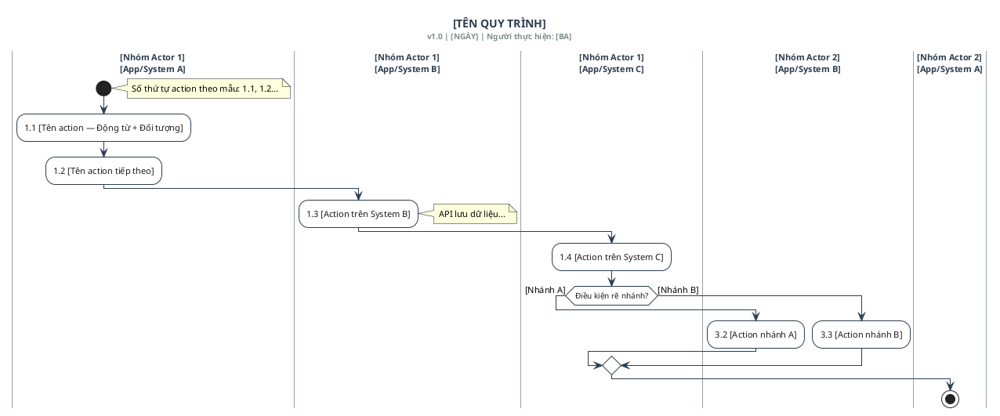

# UML Activity Diagram Skill — 3-Phase Workflow

> **Triết lý**: *"Đúng ngay từ đầu — không sửa đi sửa lại"*
> Quy trình 3 bước tường minh, tối ưu thời gian BA, output chuẩn UML 2.x ngay lần đầu.

---

## TỔNG QUAN WORKFLOW

```
PHASE 1 (Dual Mode)          PHASE 2 (Analysis)            PHASE 3 (Generate)
─────────────────────        ──────────────────────        ──────────────────
1A. Chưa có tài liệu    →    AI trả bảng phân tích:   →   PlantUML code
    BA điền template          • Actors & Systems             (render được ngay)
                              • Flow steps liệt kê      +
1B. Đã có tài liệu      →    • Gaps cần confirm         →   Mô tả nghiệp vụ
    Upload/paste doc          • Assumptions đã đặt           chuẩn BA
    AI tự extract             ──────────────────
                              BA review → reply OK
                              hoặc chỉnh sửa 1 lần
```

---

## ═══ PHASE 1 — THU THẬP INPUT ═══

### Bước đầu tiên: Phát hiện mode

Khi nhận yêu cầu, Claude PHẢI xác định ngay mode nào:

```
Có tài liệu đính kèm / paste nội dung?
├── CÓ  → Chạy PHASE 1B (Document-Based)
└── KHÔNG → Chạy PHASE 1A (Template-Based), cung cấp template cho BA điền
```

---

### PHASE 1A — Template-Based (Chưa có tài liệu)

Khi BA chưa có tài liệu, Claude trả lời NGAY bằng template sau, yêu cầu BA điền vào:

```
📋 Hãy điền template dưới đây, sau đó gửi lại cho tôi.
Bạn không cần điền đủ 100% — phần nào chưa rõ cứ để trống,
tôi sẽ xử lý ở bước tiếp theo.

━━━━━━━━━━━━━━━━━━━━━━━━━━━━━━━━━━━━━━━━
[PROCESS_NAME]
Tên quy trình: ___________________________

[SCOPE]
Bắt đầu khi: ____________________________
Kết thúc khi: ___________________________
Không áp dụng cho: ______________________

[ACTORS]
Người dùng/Vai trò liên quan: ____________
Hệ thống/Service liên quan: _____________
Bên ngoài (external): ___________________

[HAPPY_PATH]
Mô tả các bước chính theo thứ tự:
1. ______________________________________
2. ______________________________________
3. ______________________________________
(thêm nếu cần)

[ALTERNATE_FLOWS]
Luồng thay thế (nếu có điều kiện rẽ nhánh):
- Nếu [điều kiện]: ______________________
- Nếu [điều kiện]: ______________________

[EXCEPTION_FLOWS]
Trường hợp lỗi / ngoại lệ:
- Khi [sự cố]: __________________________
- Khi [sự cố]: __________________________

[BUSINESS_RULES]
Quy tắc nghiệp vụ đặc biệt:
- ________________________________________
- ________________________________________

[SLA_TIMING]
Thời gian xử lý / timeout (nếu có):
- ________________________________________

[OUTPUT_LEVEL]
Mức độ chi tiết mong muốn:
[ ] Tổng quan (main flow, không có sub-process)
[ ] Chi tiết (có exception, alternate flow đầy đủ)
[ ] Cả hai (tổng quan + drill-down từng phần)

[NOTES]
Ghi chú thêm: ___________________________
━━━━━━━━━━━━━━━━━━━━━━━━━━━━━━━━━━━━━━━━
```

Sau khi BA gửi lại template đã điền → chuyển sang **PHASE 2**.

---

### PHASE 1B — Document-Based (Đã có tài liệu)

Khi BA cung cấp tài liệu (BRD, FRD, source code, user story, email, transcript...),
Claude thực hiện theo thứ tự sau:

#### Bước 1: Xác nhận loại tài liệu & ưu tiên xử lý

| Loại tài liệu | Độ ưu tiên | Cách extract |
|---|---|---|
| Source code | ★★★★★ (cao nhất) | Đọc logic thực tế đang chạy |
| API spec / Swagger | ★★★★☆ | Đọc endpoint flow |
| BRD / FRD | ★★★☆☆ | Đọc nghiệp vụ mong muốn |
| User Story / Jira | ★★★☆☆ | Đọc acceptance criteria |
| Email / Transcript | ★★☆☆☆ | Extract ý định |
| Diagram cũ (text/ảnh) | ★★☆☆☆ | Tái cấu trúc lại |

> ⚡ **Quy tắc ưu tiên**: Khi có mâu thuẫn giữa các nguồn, **source code luôn được
> ưu tiên** vì đó là hệ thống thực tế đang chạy. Mọi mâu thuẫn với tài liệu khác
> sẽ được đánh dấu trong bảng Gaps ở Phase 2.

#### Bước 2: Xử lý quy trình lớn / nhiều sub-process

Nếu tài liệu chứa quy trình lớn với nhiều sub-process, Claude PHẢI hỏi:

```
Tôi đã đọc xong tài liệu. Phát hiện [N] quy trình/sub-process:

1. [Tên sub-process 1] — [mô tả 1 dòng]
2. [Tên sub-process 2] — [mô tả 1 dòng]
3. [Tên sub-process 3] — [mô tả 1 dòng]

Bạn muốn diagram ở level nào?
A) Tổng quan toàn bộ (1 diagram, các sub-process là action boxes)
B) Chi tiết từng sub-process (mỗi sub-process = 1 diagram riêng)
C) Cả hai (1 diagram tổng quan + drill-down từng phần)
D) Chỉ làm [số thứ tự cụ thể]: ___
```

Sau khi BA trả lời → chuyển sang **PHASE 2**.

---

## ═══ PHASE 2 — PHÂN TÍCH & CONFIRM ═══

### Mục tiêu Phase 2

Claude phân tích toàn bộ input và trả ra **1 bảng phân tích duy nhất** để BA
review. **Không hỏi từng câu lẻ tẻ**. Dừng lại hoàn toàn và chờ BA confirm.

### Format bảng phân tích bắt buộc

```
━━━━━━━━━━━━━━━━━━━━━━━━━━━━━━━━━━━━━━━━━━━━━━━━━━
📊 PHASE 2 — BẢNG PHÂN TÍCH: [TÊN QUY TRÌNH]
━━━━━━━━━━━━━━━━━━━━━━━━━━━━━━━━━━━━━━━━━━━━━━━━━━

▌ PHẠM VI
  • Bắt đầu : [trigger]
  • Kết thúc : [end condition]
  • Loại trừ : [exclusions nếu có]

▌ ACTORS & SYSTEMS
  ┌─────────────────────┬────────────┬─────────────────────────┐
  │ Tên                 │ Loại       │ Vai trò trong quy trình │
  ├─────────────────────┼────────────┼─────────────────────────┤
  │ [Actor 1]           │ Human User │ [Làm gì]                │
  │ [Actor 2]           │ System     │ [Làm gì]                │
  │ [Actor 3]           │ External   │ [Làm gì]                │
  └─────────────────────┴────────────┴─────────────────────────┘

▌ LUỒNG CHÍNH (HAPPY PATH) — [N] bước
  1. [Actor] → [Hành động cụ thể]
  2. [Actor] → [Hành động cụ thể]
  ...

▌ LUỒNG RẼ NHÁNH (DECISION POINTS)
  • Điểm rẽ 1: [Điều kiện?]
    └── [Yes] → [Hành động A]
    └── [No]  → [Hành động B]

▌ EXCEPTION / ERROR FLOWS
  • EF-01: [Mô tả tình huống lỗi + xử lý]
  • EF-02: [...]

▌ BUSINESS RULES DETECTED
  • BR-01: [Quy tắc]
  • BR-02: [...]

▌ ASSUMPTIONS (AI tự suy luận — cần BA xác nhận)
  ⚠ [ASSUMPTION-01]: [Điều AI giả định vì không thấy rõ trong tài liệu]
  ⚠ [ASSUMPTION-02]: [...]

▌ GAPS — CẦN BA BỔ SUNG (Liệt kê HẾT, 1 lần duy nhất)
  ❓ GAP-01: [Câu hỏi cụ thể — ví dụ: "Nếu OTP sai 3 lần, hệ thống làm gì?"]
  ❓ GAP-02: [...]
  ❓ GAP-03: [...]

▌ MÂU THUẪN PHÁT HIỆN (nếu có — Phase 1B)
  ⚡ CONFLICT-01: [Nguồn A nói X, Source code thực tế làm Y → Ưu tiên code]

━━━━━━━━━━━━━━━━━━━━━━━━━━━━━━━━━━━━━━━━━━━━━━━━━━
✅ Bạn xác nhận bảng trên chưa?
   • Gõ "OK" → Tôi sẽ generate diagram ngay lập tức
   • Hoặc sửa/bổ sung trực tiếp vào bảng → Tôi sẽ cập nhật và generate
   • Trả lời GAP nếu có: "GAP-01: [câu trả lời]"
━━━━━━━━━━━━━━━━━━━━━━━━━━━━━━━━━━━━━━━━━━━━━━━━━━
```

### Quy tắc xử lý gaps

- **Liệt kê TẤT CẢ gaps trong 1 lần** — không hỏi rải rác
- Nếu gap ảnh hưởng lớn đến flow → đánh dấu `❓ [CRITICAL]`
- Nếu gap nhỏ, AI có thể tự suy luận → đánh dấu `⚠ [ASSUMPTION]` và tiếp tục
- Sau khi BA reply → **không hỏi thêm**, generate luôn Phase 3

---

## ═══ PHASE 3 — GENERATE OUTPUT ═══

### Khi nào chuyển sang Phase 3

- BA reply "OK" (hoặc tương đương: "được", "đúng rồi", "generate đi")
- BA reply bổ sung gaps → Claude cập nhật bảng phân tích rồi generate ngay
- **Không hỏi thêm bất cứ điều gì** — generate luôn

### Xác định kiểu Swimlane Layout

Trước khi generate, Claude PHẢI xác định kiểu layout:

```
KIỂU A — Standard Swimlane (mặc định)
  Swimlane chỉ theo chiều DỌC (1 chiều)
  Phù hợp khi: ít actor (≤4), flow đơn giản, không phân nhóm actor

KIỂU B — Cross-functional Swimlane 2 chiều (★ THEO CHUẨN MẪU)
  Swimlane theo cả NGANG (Systems) lẫn DỌC (Actor groups)
  Phù hợp khi: có cả System và Human actor, quy trình phức tạp
  ┌──────────┬────────────┬──────────┬──────────┐
  │          │ System A   │ System B │ System C │  ← HEADER NGANG
  ├──────────┼────────────┼──────────┼──────────┤
  │ Actor 1  │            │          │          │
  ├──────────┼────────────┼──────────┼──────────┤
  │ Actor 2  │            │          │          │
  └──────────┴────────────┴──────────┴──────────┘
  ↑ CỘT DỌC TRÁI

Quy tắc chọn: Nếu tài liệu có từ 2+ system VÀ 2+ nhóm actor → dùng Kiểu B
```

### Output bắt buộc — theo thứ tự

#### OUTPUT 1: PlantUML Code

**KIỂU A — Standard Swimlane:**

```plantuml
@startuml [Tên quy trình — version 1.0]

' ===== STYLE CHUẨN =====
skinparam defaultFontName "Arial"
skinparam defaultFontSize 12
skinparam ActivityBackgroundColor #FAFAFA
skinparam ActivityBorderColor #2C3E50
skinparam ActivityBorderThickness 1.5
skinparam ActivityFontSize 12
skinparam ActivityFontColor #2C3E50
skinparam ArrowColor #5D6D7E
skinparam ArrowThickness 1.5
skinparam ActivityDiamondBackgroundColor #FFF9C4
skinparam ActivityDiamondBorderColor #F39C12
skinparam ActivityDiamondFontSize 11
skinparam NoteBackgroundColor #EBF5FB
skinparam NoteBorderColor #2E86C1
skinparam NoteFontSize 10
skinparam PartitionBackgroundColor #F8F9FA
skinparam PartitionBorderColor #AEB6BF
skinparam PartitionFontSize 13
skinparam PartitionFontStyle bold

title
  <b><color:#2C3E50>[TÊN QUY TRÌNH]</color></b>
  <size:10><color:#7F8C8D>v1.0 | [NGÀY]</color></size>
end title

|#E8F4FD| [Actor 1] |
start
:[Action];
|#FFF3E0| [Actor 2] |
:[Action];
stop
@enduml
```



---

**KIỂU B — Cross-functional Swimlane 2 chiều (theo chuẩn mẫu BVCare):**

> Dùng cú pháp `|[ActorGroup]\n[System]|` để tạo ô giao nhau giữa Actor và System



**Quy tắc đánh số action theo chuẩn mẫu:**
```
✅ Đánh số theo nhóm: 1.1, 1.2, 1.3... (nhóm 1)
                       2.1, 2.2...        (nhóm 2)
                       3.1, 3.2, 3.3...   (nhóm 3 — decision)
   Số nhóm = bước nghiệp vụ lớn
   Số sau dấu chấm = action con trong bước đó

✅ Action name = Động từ viết hoa đầu + Đối tượng cụ thể
   Ví dụ: "Tạo Đề nghị bảo lãnh"
          "Gửi Đề nghị bảo lãnh"
          "Ghi dữ liệu Đề nghị bảo lãnh"

✅ API call giữa systems → thêm note: "API lưu dữ liệu..." hoặc "API gọi đến..."

✅ Action trong DMN/External system → thêm màu nền phân biệt:
   #E8F8E8:[Action trong hệ thống ngoài];

✅ Decision node sau mỗi nhóm action quan trọng:
   if (Kết quả duyệt?) then ([Duyệt])
   elseif ([Từ chối])
   else ([Hủy])
   endif
```

**Checklist tự kiểm tra trước khi output:**
- [ ] Đúng 1 `start` node
- [ ] Ít nhất 1 `stop`/`end` node
- [ ] Mọi `if` đều có `endif`, guard condition cover all cases
- [ ] Mọi `fork` đều có `end fork`
- [ ] Không có dangling arrow (mũi tên không đến đâu)
- [ ] Swimlane assignment chính xác với actors ở Phase 2
- [ ] Số thứ tự action nhất quán (x.y format)
- [ ] Các ô giao nhau (Actor × System) được assign đúng
- [ ] Code có thể paste vào plantuml.com chạy được ngay

---

#### OUTPUT 2: Mô tả nghiệp vụ chuẩn BA

Xem template đầy đủ tại: `references/description-template.md`

**Cấu trúc bắt buộc — theo đúng định dạng mẫu:**

1. Thông tin chung (bảng metadata)
2. Mục tiêu quy trình
3. **Bảng mô tả 4 cột**: STT | Bước thực hiện | Người/Hệ thống thực hiện | Mô tả
   - Mỗi bước = 1 dòng trong bảng
   - Nhánh rẽ (Duyệt/Từ chối/Hủy) viết bằng bullet points **in đậm** ngay trong cột Mô tả
   - Tham chiếu số hình trong diagram: (hình x.x)
   - Mô tả đồng bộ API: "Sau khi [action], [System] đồng bộ [kết quả] về [System nhận]"
4. Business Rules (bảng)
5. Pre-conditions & Post-conditions

---

#### OUTPUT 3: Lưu ý & khuyến nghị BA

```
⚠️ ĐIỂM CẦN LÀM RÕ VỚI STAKEHOLDER:
   • [Vấn đề 1 cần xác nhận thêm]

💡 ĐỀ XUẤT CẢI TIẾN (nếu phát hiện bottleneck):
   • [Bước X có thể tự động hóa / song song hóa]

🔗 RENDER DIAGRAM ONLINE:
   Paste code vào: https://www.plantuml.com/plantuml/uml/
   Hoặc: https://kroki.io
```

---

## REFERENCE FILES

Khi cần chi tiết thêm, đọc các file sau:
- `references/uml-notation-guide.md` — Toàn bộ ký hiệu UML 2.x + cú pháp PlantUML
- `references/crossfunctional-swimlane-guide.md` — ★ Hướng dẫn Cross-functional swimlane 2 chiều (theo chuẩn mẫu thực tế)
- `references/diagram-patterns.md` — Pattern sẵn có: Approval, Retry, Saga, Onboarding...
- `references/description-template.md` — ★ Template mô tả 4 cột chuẩn BA (có ví dụ điền sẵn)
- `templates/INPUT_TEMPLATE.md` — Template BA điền (Phase 1A)
