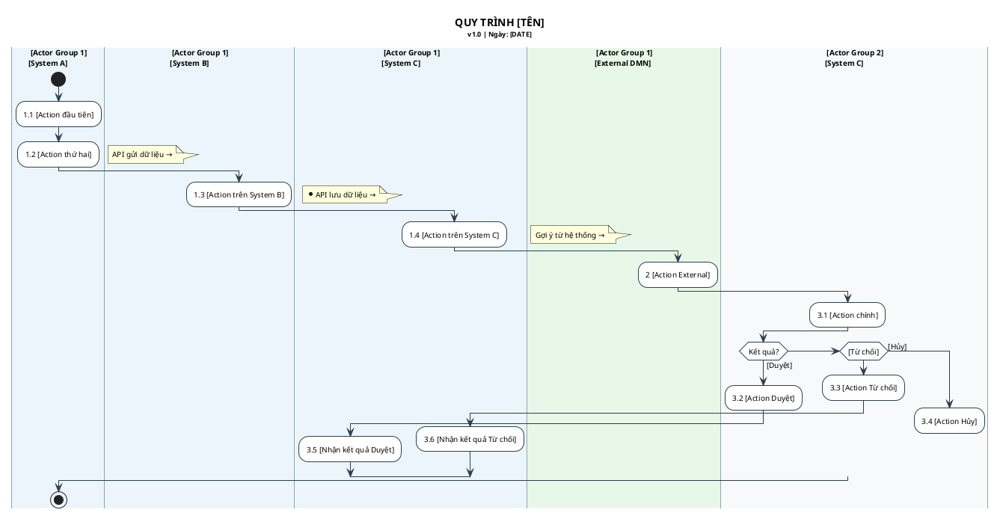

# Cross-functional Swimlane — Visual Style Reference

> Chuẩn này được trích xuất từ tài liệu mẫu thực tế (Quy trình bảo lãnh viện phí BVCare)
> Áp dụng khi quy trình có CẢ System header (ngang) VÀ Actor group (dọc)

---

## 1. Cấu trúc Layout

```
┌─────────────────────────────────────────────────────────────────┐
│ TIÊU ĐỀ: Tên quy trình                                         │
├──────────┬──────────────┬──────────┬──────────┬────────────────┤
│ (trống)  │ App Bệnh viện│BVCare GW │ BVCare   │ DMN            │  ← SYSTEMS (header ngang)
├──────────┼──────────────┼──────────┼──────────┼────────────────┤
│Cán bộ   │  [actions]   │[actions] │[actions] │  [actions]     │
│bệnh viện │              │          │          │                │  ← ACTOR GROUP 1
├──────────┼──────────────┼──────────┼──────────┼────────────────┤
│Cán bộ   │              │          │[actions] │                │
│bảo lãnh  │              │          │          │                │  ← ACTOR GROUP 2
└──────────┴──────────────┴──────────┴──────────┴────────────────┘
```

## 2. Quy tắc đặt tên Swimlane trong PlantUML

```plantuml
' FORMAT CHUẨN:
|[Tên Actor Group]\n[Tên System]|

' Ví dụ từ mẫu BVCare:
|Cán bộ bệnh viện\nApp Bệnh viện|
|Cán bộ bệnh viện\nBVCare Gateway|
|Cán bộ bệnh viện\nBVCare|
|Cán bộ bảo lãnh\nBVCare|
|Cán bộ bảo lãnh\nDMN|
```

## 3. Quy ước màu nền theo loại Actor

```plantuml
' Actor nhóm 1 (người dùng phía bệnh viện) — màu xanh nhạt
|#EBF5FB| Cán bộ bệnh viện\nApp Bệnh viện |

' Actor nhóm 2 (cán bộ bảo lãnh) — màu trắng/xám nhạt
|#F8F9FA| Cán bộ bảo lãnh\nBVCare |

' External system (DMN, hệ thống ngoài) — màu xanh lá nhạt
|#E8F8E8| Cán bộ bảo lãnh\nDMN |
```

## 4. Đánh số Action

```
Quy tắc: [Số bước nghiệp vụ].[Số thứ tự action trong bước]

Ví dụ:
  Bước 1 — "Tạo và Gửi Đề nghị bảo lãnh":
    1.1  Tạo Đề nghị bảo lãnh      ← action đầu tiên
    1.2  Gửi Đề nghị bảo lãnh      ← action thứ 2
    1.3  Gửi Đề nghị (Gateway)      ← action hệ thống
    1.4  Ghi dữ liệu                ← action hệ thống nhận

  Bước 3 — "Trả lời Đề nghị" (có decision):
    3.1  Trả lời Đề nghị bảo lãnh  ← action chính
    3.2  Duyệt Đề nghị bảo lãnh   ← nhánh Duyệt
    3.3  Từ chối Đề nghị           ← nhánh Từ chối
    3.4  Hủy hồ sơ                 ← nhánh Hủy
    3.5  Nhận kết quả Duyệt        ← phản hồi về phía bệnh viện
    3.6  Nhận kết quả Từ chối      ← phản hồi về phía bệnh viện
```

## 5. API Call giữa các System

```plantuml
' API call hiển thị bằng note trên đường chuyển swimlane
|Cán bộ bệnh viện\nApp Bệnh viện|
:1.2 Gửi Đề nghị bảo lãnh;

' Chuyển sang Gateway với note API
|Cán bộ bệnh viện\nBVCare Gateway|
note left : API gửi dữ liệu →
:1.3 Gửi Đề nghị bảo lãnh;

' Chuyển tiếp sang BVCare
|Cán bộ bệnh viện\nBVCare|
note left : *API lưu dữ liệu →
:1.4 Ghi dữ liệu Đề nghị bảo lãnh;
```

## 6. Decision Node trong Cross-functional

```plantuml
' Decision node đặt trong swimlane của người ra quyết định
|Cán bộ bảo lãnh\nBVCare|
:3.1 Trả lời Đề nghị bảo lãnh;

if (Kết quả duyệt?) then ([Duyệt])
  :3.2 Duyệt Đề nghị bảo lãnh;
  ' Kết quả trả về Actor kia
  |Cán bộ bệnh viện\nBVCare|
  :3.5 Nhận kết quả Duyệt;

elseif ([Từ chối])
  |Cán bộ bảo lãnh\nBVCare|
  :3.3 Từ chối Đề nghị bảo lãnh;
  |Cán bộ bệnh viện\nBVCare|
  :3.6 Nhận kết quả Từ chối;

else ([Hủy])
  |Cán bộ bảo lãnh\nBVCare|
  :3.4 Hủy hồ sơ;
  ' Hủy thì không có kết quả trả về → kết thúc
  kill
endif
```

## 7. Ký hiệu đặc biệt trong mẫu

| Ký hiệu trong ảnh | PlantUML tương đương | Ý nghĩa |
|---|---|---|
| Vòng tròn đặc ● | `start` | Bắt đầu quy trình |
| Vòng tròn đặc ở giữa luồng | `(*)` hoặc điểm merge | Merge nhiều nhánh lại |
| Hình thoi X | `if...endif` | Decision point |
| Đường đứt nét | note với `*API...` | API call giữa system |
| Hình chữ nhật có số | `:x.y Action;` | Action có đánh số |
| Box màu xanh (DMN) | `#E8F8E8:action;` | Action trong external system |

## 8. Template đầy đủ Cross-functional


