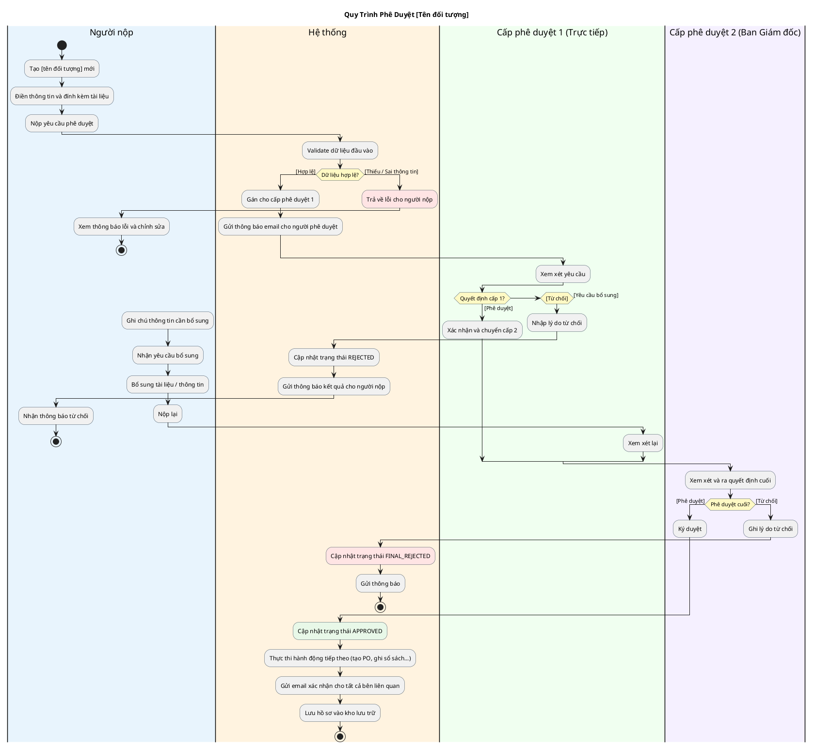
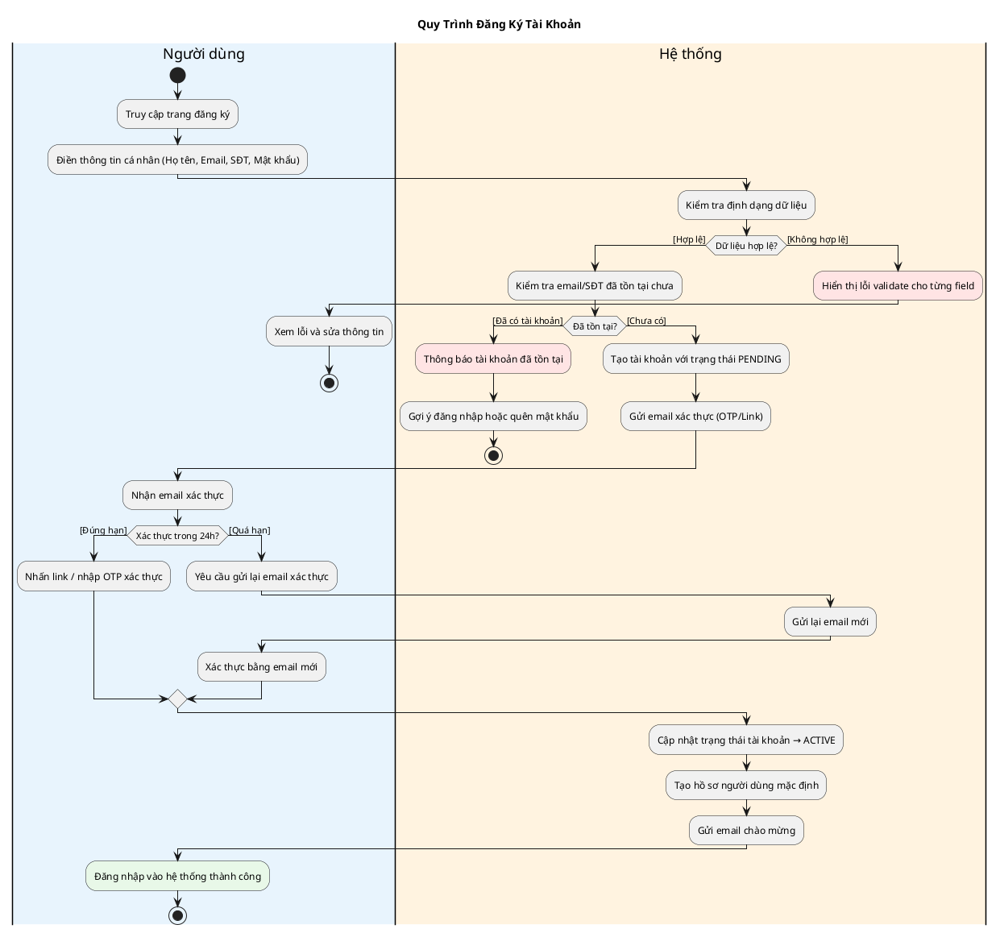
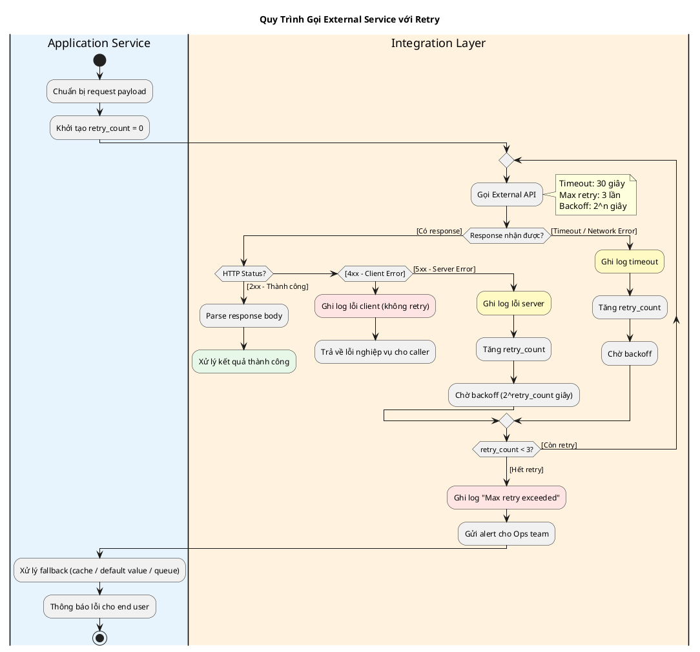
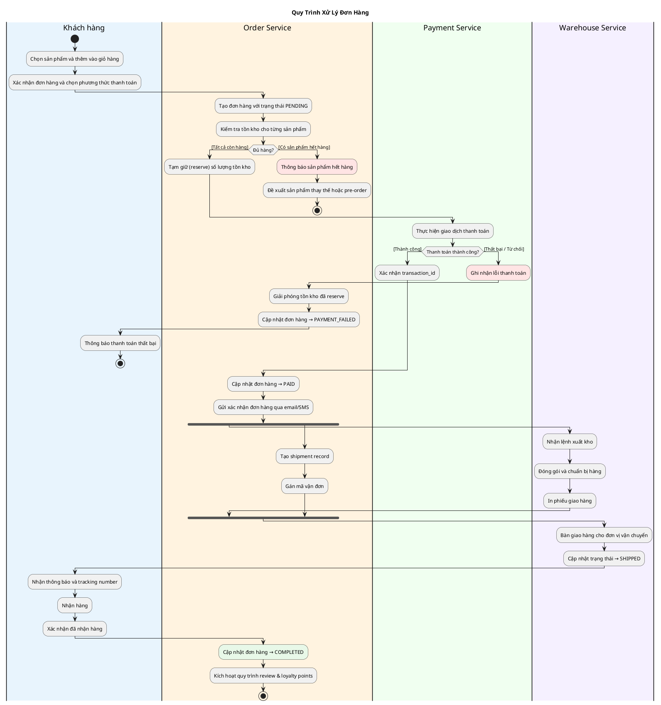
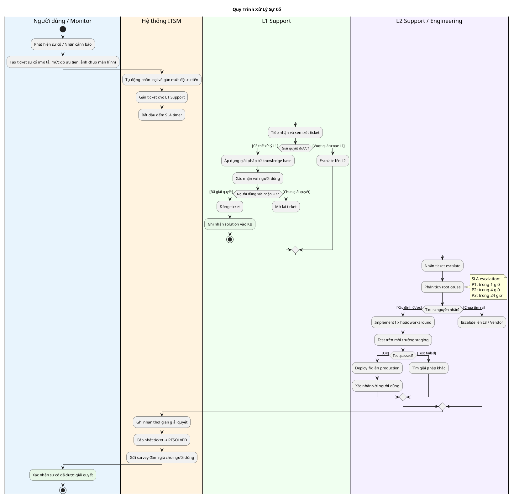
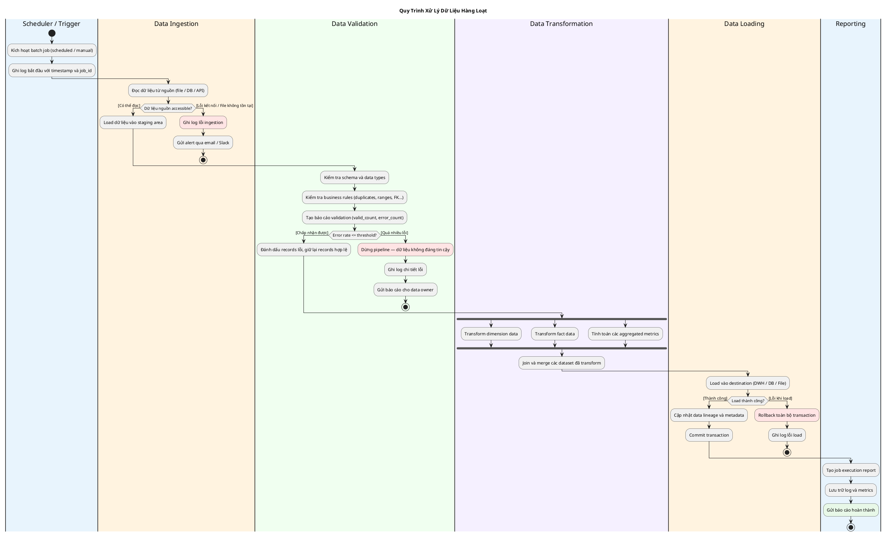

# Diagram Patterns — Các mẫu quy trình phổ biến

> Đây là bộ pattern sẵn có. Khi gặp quy trình tương tự, lấy pattern này làm
> skeleton và điều chỉnh theo thực tế. Tiết kiệm ~60% thời gian so với viết từ đầu.

---

## PATTERN 01 — Approval Workflow (Duyệt đa cấp)

**Dùng khi**: Quy trình phê duyệt hợp đồng, đơn nghỉ phép, chi phí, yêu cầu mua sắm

---

## PATTERN 02 — User Registration / Onboarding

**Dùng khi**: Đăng ký tài khoản, onboarding khách hàng mới, KYC

---

## PATTERN 03 — API Call với Retry & Timeout

**Dùng khi**: Tích hợp payment gateway, gọi external API, xử lý message queue

---

## PATTERN 04 — Order Processing (E-Commerce)

**Dùng khi**: Đặt hàng, thanh toán, fulfillment

---

## PATTERN 05 — Incident Management (IT/Support)

**Dùng khi**: Xử lý sự cố, ticket support, escalation

---

## PATTERN 06 — Data Processing Pipeline (ETL/Batch)

**Dùng khi**: Xử lý file import, ETL, batch job, data migration

