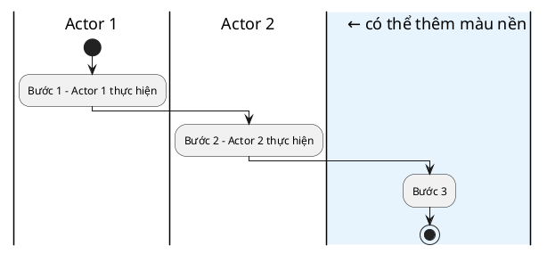

# UML 2.x Activity Diagram — Notation Reference Guide

## 1. Bảng ký hiệu đầy đủ UML 2.x

### Nodes cơ bản

| Ký hiệu UML | PlantUML syntax | Tên gọi | Khi nào dùng |
|---|---|---|---|
| ● (filled circle) | `start` | Initial Node | Bắt đầu quy trình. Luôn có đúng 1 cái |
| ⊙ (circle+dot) | `stop` hoặc `end` | Activity Final Node | Kết thúc toàn bộ quy trình |
| ⊗ (circle+X) | `kill` | Flow Final Node | Kết thúc 1 nhánh, không kết thúc toàn bộ |
| □ bo góc | `:Tên action;` | Action / Activity | Mỗi bước xử lý, hành động |
| ◇ | `if...then...else...endif` | Decision Node | Điểm rẽ nhánh có điều kiện |
| ◇ (nhiều vào 1 ra) | tự động khi merge | Merge Node | Gộp nhiều nhánh lại |
| ━━━ (thanh ngang) | `fork` / `end fork` | Fork / Join Bar | Bắt đầu / kết thúc xử lý song song |
| [ ] trên arrow | `([điều kiện])` | Guard Condition | Điều kiện trên mũi tên |
| ‖ (dải dọc) | `\|Actor\|` | Swimlane / Partition | Phân vùng theo actor/system |

### Nodes nâng cao

| Ký hiệu UML | PlantUML syntax | Tên gọi | Khi nào dùng |
|---|---|---|---|
| Hình thang gửi | `:Signal >>` | Send Signal | Gửi event/notification ra ngoài |
| Hình thang nhận | `:<< Signal` | Accept Event | Nhận event từ bên ngoài |
| Đồng hồ | dùng note | Time Event | Trigger theo thời gian (cron, timeout) |
| Hình chữ nhật kép | dùng note | Call Behavior | Gọi một sub-activity diagram khác |

---

## 2. Cú pháp PlantUML đầy đủ

### 2.1 Swimlane cơ bản



### 2.2 Decision Node — rẽ nhánh

```plantuml
' Binary (2 nhánh)
if (Điều kiện?) then ([Có / Yes])
  :Xử lý nhánh A;
else ([Không / No])
  :Xử lý nhánh B;
endif

' Multi-branch (3+ nhánh)
if (Kết quả kiểm tra?) then ([Đạt])
  :Phê duyệt;
elseif ([Cần bổ sung])
  :Yêu cầu bổ sung tài liệu;
else ([Không đạt])
  :Từ chối và thông báo;
endif
```

### 2.3 Fork / Join — xử lý song song

```plantuml
' Parallel processing
fork
  :Task song song A;
  :Sub-task A1;
fork again
  :Task song song B;
fork again
  :Task song song C;
end fork
' Sau end fork = tất cả nhánh đã hoàn thành
:Tiếp tục sau khi tất cả xong;
```

### 2.4 Loop — vòng lặp

```plantuml
' Repeat-until
repeat
  :Thực hiện bước lặp;
  if (Điều kiện tiếp tục?) then ([Tiếp])
  else ([Dừng])
    break
  endif
repeat while (Còn item?) is ([Có item])
-> [Hết item];

' While loop
while (Retry < 3?) is ([Còn retry])
  :Thử lại kết nối;
  :Tăng retry counter;
endwhile ([Hết retry])
:Báo lỗi timeout;
```

### 2.5 Notes & Comments

```plantuml
:Action quan trọng;
note right
  📌 Business Rule BR-01:
  Giá trị phải > 0 và <= 1,000,000
  Timeout: 30 giây
end note

note left of (action)
  ⚠️ Exception: nếu lỗi kết nối
  → retry tối đa 3 lần
end note
```

### 2.6 Object Node — truyền dữ liệu

```plantuml
:Tạo đơn hàng;
:Đơn hàng mới[created] <<artifact>>;   ← object node
:Gửi đơn cho kho;
```

### 2.7 Màu sắc cho action nodes

```plantuml
' Error / Exception actions
#FFE4E4:Ghi log lỗi hệ thống;

' Success / Completion actions  
#E8F8E8:Cập nhật trạng thái thành công;

' Warning / Attention needed
#FFF9C4:Gửi alert cần xem xét;

' External system actions
#F0F0FF:Gọi API thanh toán bên thứ 3;
```

---

## 3. Lỗi UML phổ biến và cách sửa

### Lỗi về Decision Node

```
❌ Sai — Guard condition không cover hết case:
if (Số dư đủ?) then ([Đủ])
  :Thực hiện giao dịch;
endif
' → Không có nhánh "Không đủ"!

✅ Đúng:
if (Số dư đủ?) then ([Đủ])
  :Thực hiện giao dịch;
else ([Không đủ])
  :Thông báo số dư không đủ;
endif
```

### Lỗi về Action Name

```
❌ Sai — Tên mơ hồ:
:Xử lý;
:Kiểm tra;
:Cập nhật;

✅ Đúng — Tên cụ thể, có động từ + đối tượng:
:Xác thực thông tin đăng nhập người dùng;
:Kiểm tra số dư tài khoản nguồn;
:Cập nhật trạng thái đơn hàng thành CONFIRMED;
```

### Lỗi về Fork/Join

```
❌ Sai — Fork không có Join:
fork
  :Task A;
fork again
  :Task B;
' Thiếu end fork → code lỗi

✅ Đúng:
fork
  :Task A;
fork again
  :Task B;
end fork
:Tiếp tục sau parallel tasks;
```

### Lỗi về Swimlane

```
❌ Sai — Action đặt nhầm lane:
|Khách hàng|
:Kiểm tra tồn kho trong database;  ← đây phải là System làm

✅ Đúng:
|Hệ thống|
:Kiểm tra tồn kho trong database;
```

---

## 4. Mapping BPMN → UML Activity Diagram

| BPMN Element | UML Activity Diagram Equivalent |
|---|---|
| Start Event (circle) | Initial Node ● |
| End Event (bold circle) | Activity Final Node ⊙ |
| Terminate End Event | Activity Final Node ⊙ |
| Intermediate Catch Event | Accept Event Action |
| Intermediate Throw Event | Send Signal Action |
| Task (rounded rect) | Action |
| Sub-Process (rect + +) | Call Behavior Action |
| XOR Gateway (X) | Decision / Merge Node ◇ |
| AND Gateway (+ ) | Fork / Join Bar ━━━ |
| OR Gateway (circle) | Decision (dùng nhiều if/elseif) |
| Pool | Activity |
| Lane | Partition / Swimlane |
| Data Object | Object Node |
| Message Flow | Signal Send/Receive |
| Timer Event | Time Event (dùng note) |

---

## 5. Level of Detail — Khi nào dùng level nào

| Level | Khi nào phù hợp | Đặc điểm |
|---|---|---|
| **L1 — Overview** | Executive summary, kickoff meeting | 5-10 actions, không có exception |
| **L2 — Business Flow** | Tài liệu BRD, stakeholder review | 10-20 actions, có alternate flow |
| **L3 — Detailed** | Tài liệu đặc tả kỹ thuật, dev handoff | 20+ actions, exception đầy đủ, có note |
| **L4 — Implementation** | Technical design, code review | Có object nodes, system calls, data flow |
